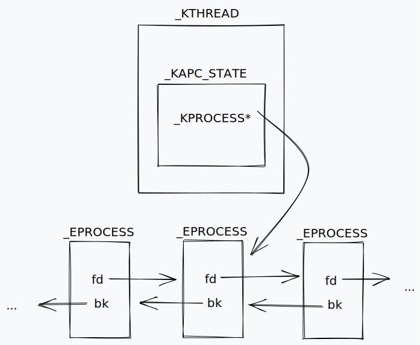

# Windows Kernel Internals

## Generalities

### Windows APIs

- Windows API
  - callable from user mode
  - wrapper to call Native API, e.g., `CreateFile`, with extra sane checks
- Native API
  - callable from user mode
  - wrapper to syscall, context switch to kernel mode and call Kernel API, e.g., `NtCreateFile`
- Kernel API - e.g., `ZwCreateFile`

`CreateFile` -> `NtCreateFile` -> `ZwCreateFile`

### Processes

- A process has:
  - VA space
  - handles to system objects
  - an access token
  - PID
  - one thread
- Tracked in kernel with [`_EPROCESS`](https://www.vergiliusproject.com/kernels/x64/Windows%2011/21H2%20(RTM)/_EPROCESS) structure

### Threads

- Two stacks, user and kernel mode
- Thread-Local Storage (TLS): private user mode storage
  - self note: in Linux, it stores stack cookie value
- Tracked in kernel with [`_ETHREAD`](https://www.vergiliusproject.com/kernels/x64/Windows%2011/21H2%20(RTM)/_ETHREAD) structure

### Virtual Memory

- 32-bit arch:
  - half (2GB) is for user space, another half (2GB) is for kernel space
- 64-bit arch
  - user
    - address starts with `0x0000`, range: `0x00000000 00000000` - `0x00007FFF FFFFFFFF`
  - kernel
    - address starts with `0xFFFF`, range: `0xFFFF8000 00000000` - `0xFFFFFFFF FFFFFFFF`
- memory page
  - 4KB or 1MB
  - permissions are set per page
    - self note: if some part of `.data` section shares the same memory page with `.text` section, this data could be used for `ROP` (source: Gynvael)

### Virtual Address Spaces

- kernel page tables used to be accessible by userland page tables
  - Meltdown and Spectre side-channel attack
- `KPTI` (Kernel Page Table Isolation)
  - make kernel page tables inaccessible
  - self note:
    - experience in Linux, could be bypassed with `KPTI` trampoline to safely return from kernel space to userspace, otherwise it causes segfault
    - another trick is to use signal handler since the segfault happens after returning to userspace <https://trungnguyen1909.github.io/blog/post/matesctf/KSMASH/>

### Sessions

- Session 0 for system services
- Session 1 and above for interactive login sessions

### Hypervisor vs. Kernel vs. User

- Hypervisor Mode: Ring -1
- Kernel Mode: Ring 0
  - has R/W access to userland (what about `SMAP`?)
  - Limited userland code execution due to `SMEP`
    - solution is to do `ROP` (reusing kernel space code) but need to defeat `KASLR`
  - self note: `SMAP` and `SMEP` are set on `CR4` register, used to be overwritable based on past blogposts that I read on Linux kernel exploitation
- User Mode: Ring 3

### Objects

- consists of data, attributes, and functions
- example: `_EPROCESS`, `_ETHREAD`, `_FILE_OBJECT`
- `ObCreateObject()`
- Sysinternal tools: `WinObj`

### Handles

- similar to file descriptor in Linux
- references to an instance of an object
- an object could be referred by multiple handles
- has its own permissions
- each process has its own handle table
- generally created with `ObOpenObjectByName()`, `ObOpenObjectByPointer()`

## System Components

- Any `_E*` structure would typically have the kernel counterpart `_K*` structure
- Every windows system has these processes which may be useful to get system level token
  - smss.exe
  - lsm.exe
  - csrss.exe
  - wininit.exe
  - winlogon.exe
  - services.exe
  - lsass.exe
  - svchost.exe

### NTDLL.DLL

- libc equivalent
- abstracting access to syscall
- most functions that we call comes from `kernel32.dll` and `user32.dll`, which then calls `ntdll.dll`
- manage heap
- contains CRT (C runtime) functions, e.g., `memcpy()`
- the wrapper might have some sanity checks which may not be ideal to reach kernel space; hence, need to invoke syscall on our own with raw assembly instruction

### I/O processing

- User mode (Ring 3)
  1. user code calls `kernel32.dll!ReadFile()`
  2. `kernel32.dll` calls `ntdll.dll!NtReadFile()`
  3. `ntdll` invoke syscall, context switch to kernel mode
- Kernel mode (Ring 0)
  1. `ntoskrnl.exe` calls `NtReadFile()`
  2. `ntoskrnl.exe` invoke driver
  3. `driver.sys` handles I/O operation

### Executive Layer

Manage:

- processes
- threads
- system configuration
- general I/O

### Kernel Layer

- abstracting the hardware layer

### Hardware Abstraction Layer (HAL)

- well documented
- commonly used for windows kernel exploitation
- contains many interesting pointers to functions or structures
- does not have address randomization until recently (how recent? Windows 10 1703)

### Win32k.sys

- for windowing stuff and browser
- handles syscalls from `gdi32.dll` and `user32.dll`
- used to be the most popular attack surface before sandbox protection was implemented (syscall filter, similar to `seccomp`)
- sometimes leads to UAF due to callback into `user32.dll` inside kernel mode

## System Mechanisms

### Interrupt Descriptor Table (IDT)

- contains handlers for different interrupts
- although it is named `interrupt`, it also tracks synchronous exception traps but not `syscall` exceptions
- `SIDT` assembly instruction could be executed from userland (unprivileged instruction) to get the address of `IDT` and with arbitrary read primitive, we could leak kernel addresses
- `SIDT` store table address into the destination operand
- `LIDT` is privileged instruction, **l**oad values in the source operand into the table

### Global Descriptor Table (GDT)

- table of memory regions
- `gs` register (64-bit), `fs` (32-bit)
  - self note: usually use to access `TEB` (thread environment block) and `PEB` (process environment block)
- accessed with `SGDT` and `LGDT` assembly instructions

### System Service Descriptor Table (SSDT)

- equivalent of Linux syscall table
- `nt!KiServiceTable` is referenced by `KeServiceDescriptorTable`
- To calculate the corresponding syscall routine (useful for analyzing new syscall)
  1. `dd nt!KiServiceTable + <syscall number>*4` to get the relative offset
  2. `u KiServiceTable + (<offset> >>> 4)` to disassemble the routine
- <https://github.com/j00ru/windows-syscalls>

### Alertable State

- use by `win32k.sys` for userland callback
- asynchronous procedure call (APC)
- the procedure is run as soon as an alertable thread is scheduled
- functions that could set alertable thread:
  - `KeWaitForSingleObject()`
  - `KeWaitForMultipleObjects()`
  - with the argument `Alertable` set to `TRUE`
- useful for pivoting to userland after getting kernel code execution

```cpp
NTSTATUS
KeWaitForSingleObject (
    PVOID Object,
    KWAIT_REASON WaitReason,
    KPROCESSOR_MODE WaitMode,
    BOOLEAN Alertable, // <=====
    PLARGE_INTEGER Timeout
    );

NTSTATUS
KeWaitForMultipleObjects (
    ULONG Count,
    PVOID Object[],
    WaitType,
    KWAIT_REASON WaitReason,
    KPROCESSOR_MODE WaitMode,
    BOOLEAN Alertable, // <=====
    PLARGE_INTEGER Timeout,
    PKWAIT_BLOCK WaitBlockArray
    );
```

### Interrupt Request Level (IRQL)

- used by kernel to check if the caller that triggered the interrupt has appropriate level or not
- if not appropriate, it causes BSOD (blue screen of death)
- level 0 (`PASSIVE_LEVEL` or `LOW_LEVEL` in WinDbg) is for user thread
- code running on higher IRQL cannot be interrupted by lower IRQL code
  - `APC_LEVEL` (level 1): APCs are disabled and cannot interrupt the thread, e.g., `KeEnterCriticalRegion()`, and `KeLeaveCriticalRegion()`
  - `DISPATCH_LEVEL` (level 2): both dispatch and APC are disabled
- when doing kernel exploitation and we try to access userland data, this would usually issue a page fault to map the memory
- page fault is allowed at IRQL <= 1, however at `DISPATCH_LEVEL` this would cause BSOD
- IRQL information is stored in `CR8` register

### Object Manager

- serve as an API to create, modify, deletes objects
- Direct Kernel Object Manipulation (DKOM) used by rootkit to bypass AV, which tracks the usage of object manager API

### `_E*` structures vs. `_K*` structures

- `_E*` is executive version
- `_K*` is kernel version
- `_K*` structure is usually the first member of `_E*` structure

### Common Objects

- `_EPROCESS`
- `_ETHREAD`
- `_EJOB`
- `_SECTION_OBJECT_POINTERS`
- `_FILE_OBJECT`
- `_KTOKEN`: for privilege escalation, patch our `_EPROCESS` structure to point to system level `_TOKEN`
- `_KSEMAPHORE`: for synchronization
- `_KMUTANT`: for mutex
- `_KTIMER`
- `_CM_KEY_BODY`

### Synchronization

- mutual exclusion principle
- prevent UAF and race condition

#### Interlocked Operation

- `_interlockedbittestandset64(&OwnerThread->ThreadLock, 0i64)`
- `lock bts [rbx+_KTHREAD.ThreadLock]`
- tests if 0th bit is set, and set it to 1

#### Spinlock

- while loop to constantly check if the resource is locked or not

#### Mutex

- `KeWaitForSingleObject()`: API to wait for mutex
- If our thread cannot obtain the mutex, our thread would go into blocking state and might become alertable

#### Critical Section

- adjust IRQL to prevent interrupts
- cannot be shared across processes unlike mutex

## Processes and Threads

### Executive Process (`_EPROCESS`)

- Each process has an `_EPROCESS` block in kernel memory
- Fields:
  - `Pcb`: process control block
  - `ActiveProcessLinks`: doubly linked list of `_EPROCESS` structures, use to traverse the list and look for PID 4
  - `UniqueProcessId`
    - PID 4 belongs to system process that has the kernel main threads (static across all Windows versions)
  - `Token`: describe the process privileges

### Process Environment Block (`_PEB`)

- Each process has one in user process memory
- content:
  - loaded module list
  - thread local storage (TLS) data
  - heap information

### Process Kernel Global Variables

```windbg
dt nt!_list_entry poi(nt!PsActiveProcessHead)
dl PsActiveProcessHead
dq nt!PsIdleProcess L1
dq nt!PsInitialSystemProcess L1
```

### Executive Thread (`_ETHREAD`)

- Each thread has an `_ETHREAD` block in kernel memory
- content:
  - pointer to the process `_EPROCESS` via `_KTHREAD`
  - start address
  - impersonation information

### Thread Environment Block (`_TEB`)    

- Each thread has one in user process memory
- content:
  - stack bounds information
  - pointer to `_PEB`

### Accessing Processes and Threads

- `GS:0`
  - points to `_TEB` in user mode
  - points to `_KPCR` (kernel processor control region) in kernel mode

- `_KPCR` contains `_KPRCB` as an in-line structure (kernel processor control block) (`gs` offset >= `0x180`)
- `_KPCR.Self`: self pointer (to `_KPCR` structure) at offset `0x18`
- `_KPCRB` contains pointer to `_KTHREAD` at offset 0x8
- Thus, `_KTHREAD` could be accessed at offset `0x180 + 0x8 = 0x180`
- `_KTHREAD` has pointer to the current process `_KPROCESS`



## Kernel Memory Pools

- pool = kernel heap
- windows kernel pools has mix chunk sizes, unlike Linux's kernel heap (slab allocator) which has same chunk size for a given memory region, like `kmalloc-8`, `kmalloc-16`, `kmalloc-32`, etc.

### Pool Internals

- two main pools:
  - pageable
  - non-pageable, never paged out, so page fault never occurs (safe for any IRQL)
- each chunk (both alloc'd or free) has in-line `POOL_HEADER` structure before the chunk data

```windbg
dt _POOL_HEADER <addr>
!pool <addr> <flags>
```

### Pool Types

- Non-paged
- Paged
- Look-aside lists
  - fast allocation for small fixed size blocks (< 256 bytes)
  - can be paged or non-paged
  - self note: similar to bins in Linux (tcachebins, fast bin, small bin, etc.)
- Kernel Low Fragmentation Heap (kLFH)
  - available in latest Windows versions
  - off by default on Windows 1809 (RS5)
  - on by default on Windows 1903 (19H1)
  - different object types are allocated on different pages
  - effective for mitigating UAF

## Kernel Bug Exploitaiton

### End Goals

- kernel mode code execution
- sandbox escape
- token-based privilege escalation

### Common Primitive Goals

- arbitrary read/write primitives

### Common Exploitation Techniques

- NULL dereferences
  - used to be feasible since we could allocate memory address near `0x0`
- UAF / Type Confusion
  - use to get other primitives:
    - overflow corruption
    - type confusion
    - arb read/write
- integer overflow/underflow
- race conditions
  - leads to UAF, bad length checks, etc.
- memory information disclosure (memory leak)
  - use to bypass `KASLR`

## Mitigations

- NX/DEP
  - implemented in `PTE` (page table entry)
  - before Windows 8, non-paged pool is marked as executable
- KASLR
  - effective for remote kernel exploitation
  - limited for local kernel exploitation
- NULL page mitigation
  - implemented from windows 8
- SMEP
  - unable to get `PC` (program counter) points to user space code while in kernel mode
  - implemented from windows 8
- Object `TypeIndex` field encoding
  - objects tracked by object manager has `_OBJECT_HEADER` structure prefixed in front of the structure
  - formula: `(2nd least significant byte of OBJECT_HEADER address ^ typeindex ^ nt!ObHeaderCookie`
  - `OBJECT_HEADER` address is the object address - `0x30` (`0x30` is `OBJECT_HEADER` size)
- Kernel safe-unlinking
  - check if `Entry->Flink->Blink == Entry->Blink->Flink == Entry`
  - only kernel pool allocator on Windows 7
  - all kernel linked list on Windows 8
- Kernel Virtual Address (KVA) Shadow
  - the same as KPTI
  - swap page tables when context switching
  - originally to prevent Meltdown
  - implemented from Windows 10
- SMAP
  - partially added to Windows 10 1903
    - only enabled in paths handling `DISPATCH_LEVEL` and interrupts
  - could be used to craft structures in userland and with memory corruption vuln make a pointer points to our userland structure
  - self note: stack pivoting is still possible?
- page table self mapping index randomization
  - page table address used to be non-randomized and the index for self reference is static and `SMEP` could be disabled by modifying the page table

## Security Concepts

### Access Checks

- happen every time a thread opens an object (e.g., `CreateProcess` and `CreateFile`)
- done by the security reference monitor
- check based on the thread's token and the objects security descriptor

### Tokens

- `!token`
- privileges, accounts, groups, session, impersonation level, integrity level
- token structures are stored in kernel space

### Security Descriptors

- `!sd` show security descriptor (`_OBJECT_HEADER->SecurityDescriptor >> 4 << 4`)
- contains owner SID, group SID

### Access Control List/Entries

- ACL contains ACE structures
- ACE structure contains SID to allow or deny access to an object

### Account Rights

- associated with an account
- can be allow or deny

### Privileges

- stored in token
- can be enabled/disabled
- useful:
  - `SeDebugPrivilege`
  - `SeCreateTokenPrivilege`: admin equivalent
  - `SeImpersonatePrivilege`

## Kernel Payloads

- Generally, it is not feasible to create a new high privileges processes with kernel privileges
- But we could do less privileged action by migrating into userland and execute the userland payload with system privileges (require kernel code execution)
- local privilege escalation only requires arb read/write on kernel memory

### Token Stealing

- find the `System` process (PID 4) by traversing the `_EPROCESS` lists
- grab the token address
- traverse the list again to find our target process for privilege escalation
- modifying the pointer to point to system token

### SID Replacement

- patch owner SID to `Local System`
- patch group SID to `Administrators`

### Privilege Patching

- only require to change the privilege bits

## Note

- any application can retrieve the base address of any kernel module with `NtQuerySystemInformation()` API together with `SystemModuleInformation` information class (<https://j00ru.vexillium.org/2011/06/smep-what-is-it-and-how-to-beat-it-on-windows/>)
